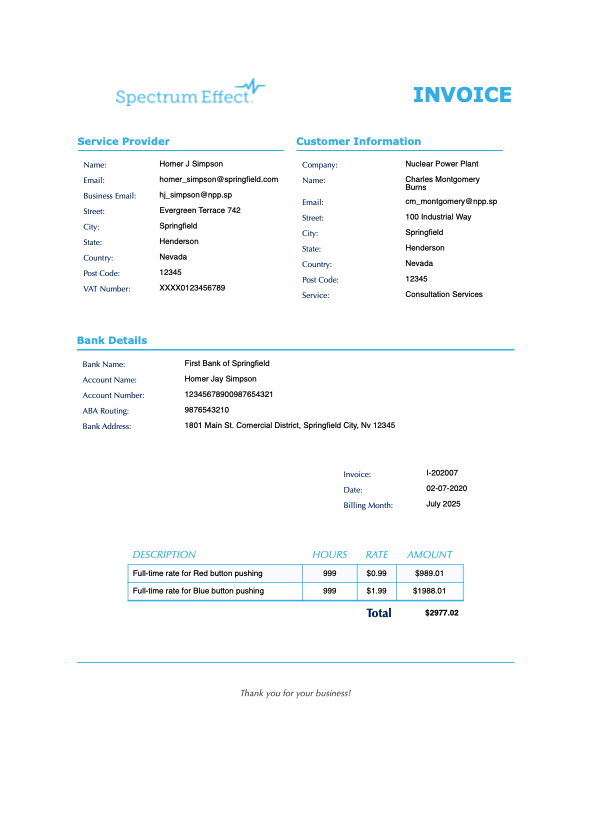
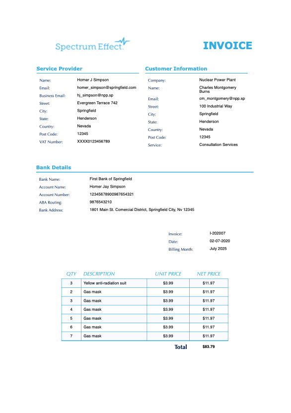

# CUSTOM INVOICE GENERATOR

This repository contains a Python script, which relies on some PIP modules to read and interpret JSON files and convert them into a PDF invoice based on an HTML template.

Because it's based on HTML, configuration and customization are possible using CSS and the structure you want to give to the HTML.


By default, the initial script can generate two invoice styles:
* an hourly rate invoice
* an item cost invoice




In both cases, two types of templates are available: the basic one, which contains up to 7 lines of items or descriptions, and an advanced one, which generates a second invoice page for the remaining items that exceed the first 7 charges.

This is under construction, but some ideas to add include integration with signature or stamping, calculating total amounts for each item based on its characteristics, archiving generated invoices for posting, or automatically assigning the generated invoice number.

## First steps

> It is recommended to use a virtual environment to install dependencies.

Install the repository dependencies:
```bash
pip install -r requirements.txt
```


Run the script to generate the PDF
```bash
python3 code
```
It's that easy!

### Repository Structure

Understanding the repository structure

```bash
.
├── fixed_data.json
├── invoice_data.json
├── LICENSE
├── README.md
├── requirements.txt
├── invoice_generator.py
└── templates
    ├── advance_template.html
    ├── basic_template.html
    ├── components
    │   ├── item_box_item_desc.html
    │   └── item_box_rate.html
    ├── fonts/...
    │   └── Source/...
    ├── logos/...
    └── static
        ├── item_box_styles.css
        └── template_styles.css
```